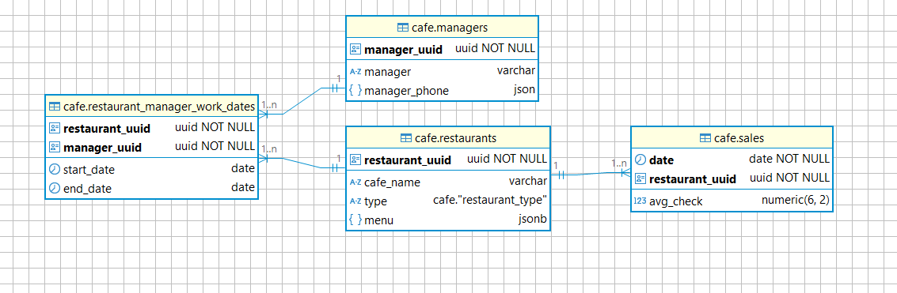

# RestaurantETL

### **Описание ETL проекта**
Цель проекта: организация процесса сбора, преобразования и загрузки данных для дальнейшего анализа.Загрузка датасета в СУБД для удобства работы и централизованного хранения информации.Создание нормализованной схемы базы данных с минимизацией дублирования и повышением целостности данных.  
Разделение данных на тематические группы (таблицы);  
Определение связей между таблицами (отношения один-к-одному, один-ко-многим, многие-ко-многим).Наполнение созданных таблиц обработанными данными из исходного датасета.Составление аналитических SQL-запросов для выборки необходимых данных, формирования отчетов и визуализации ключевых показателей.

---

**В файле дампа содержатся данные о сети ресторанов Gastro Hub.**
--
~~~bash
dump_gastrohub.sql
~~~
raw_data.sales — необработанные данные о продажах
--
report_date Дата `date`  
type Тип заведения `character varying`  
cafe_name	Название заведения `character varying`  
avg_check	Средний чек за день `numeric(6, 2)`  
manager	Ф. И. О менеджера заведения `character varying`  
manager_phone	Телефон менеджера заведения `character varying`   

**raw_data.menu — необработанные данные о меню заведений**  
--
cafe_name	Название заведения  `character varying`  
menu	Меню  `jsonb`

**ERD-диаграмма нормализованных таблиц**
--

--
Таблица `cafe.restaurants` содержит информацию о ресторанах.  
Поля: restaurant_uuid, название заведения, тип заведения и меню.

Таблица `cafe.managers` содержит информацию о менеджерах.  
Поля: manager_uuid, имя менеджера и его телефон.

Таблица `cafe.restaurant_manager_work_dates` таблица хранит дату начала работы в ресторане и дату окончания работы в ресторане.
Поля: restaurant_uuid, manager_uuid, работа менеджера в ресторане от даты начала до даты окончания — единый период, без перерывов.

Таблица `cafe.sales` хранит даты и средний чек заведения.

#### Скрипты
- [DDL](DDL.sql) - запросы на создание схемы `cafe` и объектов в ней в нужном порядке.
- [INSERT](INSERT.sql) - запросы на заполнение таблиц данными.
- `task_1.sql` - `task_7.sql` - решения заданий в порядке их выполнения.

